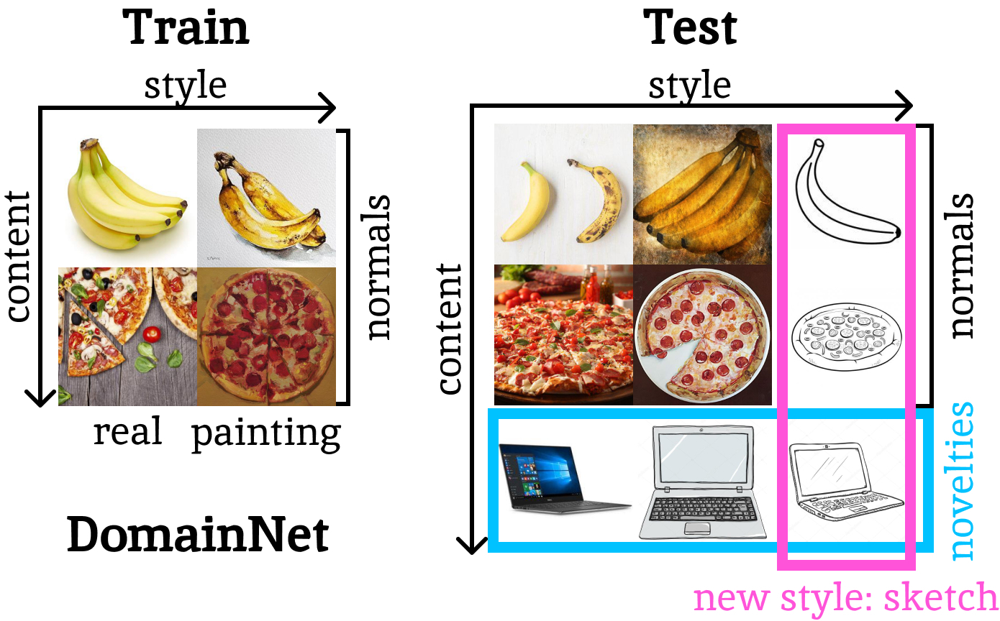
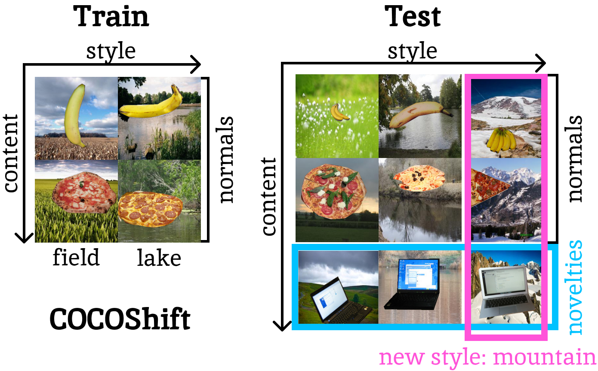
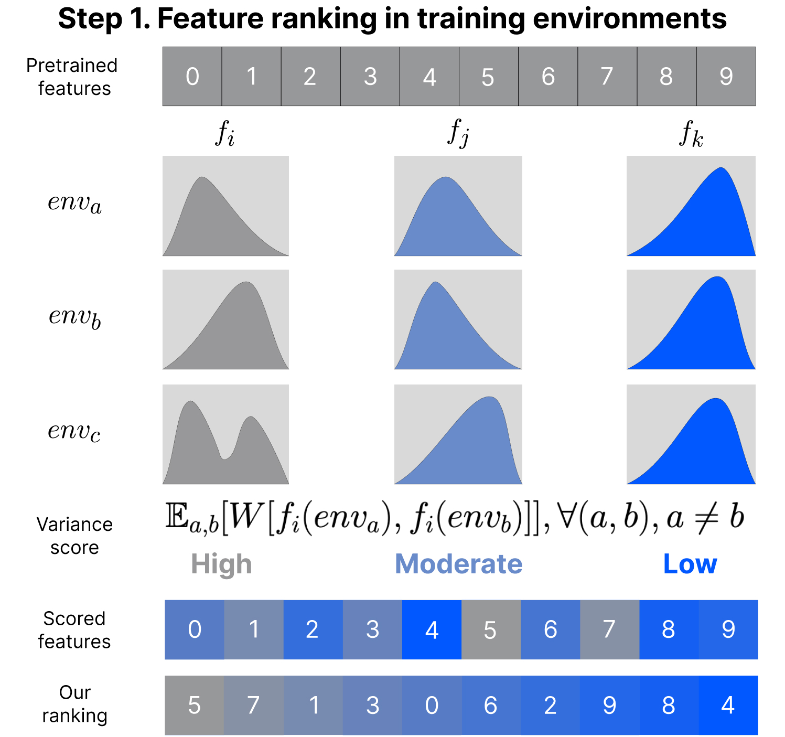
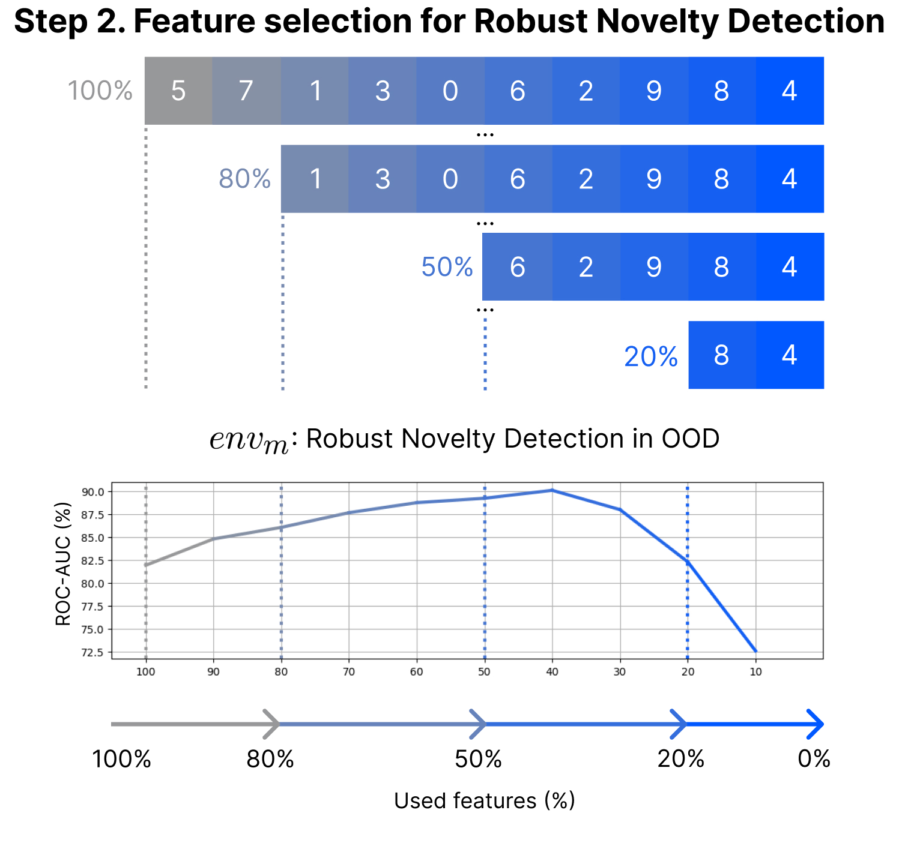

# Stylist

- **Title**: *Stylist: Style-Driven Feature Ranking for Robust Novelty Detection*
- **Authors**: Stefan Smeu*, Elena Burceanu*, Emanuela Haller*, Andrei Liviu Nicolicioiu
- **[ArXiv Preprint](https://arxiv.org/pdf/2310.03738.pdf)**

A short version of the paper was accepted at **ICCVW 2023** - Workshop and Challenged for Out-of-Distribution Generalization in Computer Vision (ICCV 2023), under the title *Environment-biased Feature Ranking for Novelty Detection Robustness*

## Table of Contents

1. [Robust Novelty Detection Task](#robust-novelty-detection-task)
2. [Stylist](#stylist)
3. [Prepare Environment](#prepare-environment)
4. [Data](#data)
5. [Usage](#usage)
6. [Cite](#cite)

## Robust Novelty Detection Task

<div align="center">
  
  
</div>

We work in a multi-environment setup, where each training environment changes the style of the samples, while all the environments contain a set of *seen* content 
classes. The goal of training environments is to define what is content and what is style. Consequently, we are not restricted to a certain style definition but 
rather expect the training environments to define what might be correlated with our task, but is not actually relevant. Then, we define an evaluation environment, 
containing *both seen and novel* classes with an associated new style. The goal of **robust novelty detection** is to separate between *seen* and *novel* 
content classes, without being affected by the new style.


## Stylist 

<div align="center">
  
  
</div>

We focus on discovering which features from a given, pretrained representation, are more environment-biased, thus prone to contain spurious correlations, 
and should be better ignored. Finding the robust part of a representation is closely linked to invariance between environments, thus we want to have a measure of 
variance for each dimension in our representation. We first quantify the degree of change in each feature distribution, and then we drop the ones that vary more.

Our algorithm works over the representations extracted from a frozen model. We assume that for each sample of our training set, we start with a vector of $N$ features. We proceed in two steps:

- **Step 1. Feature ranking in training environments** 
First, we compute a score that says how much a feature changes across environments. For each feature $i$, we consider $f_i(env)$ to be the distribution of this feature in environment $env$. We employ the Wasserstein distance to compute the distance between the distributions of each feature $i$, across pairs of environments $(a, b)$.

    $dist_i(env_a, env_b) = W(f_i(env_a), f_i(env_b)), \quad \forall i \in [1..N]$

    The per-feature score is obtained next as the expected value of the Wasserstein distance across all pairs of environments  $(env_a, env_b)$, where $a \neq b$.

    $score_i = \mathbb{E}_{a,b}[dist_i(env_a, env_b)] , \quad \forall i \in [1..N]$

- **Step 2. Features selection for Robust Novelty Detection** 
Next, since our purpose is to be robust and to be able to ignore environment changes, we remove features with top scores. 
The intuition here is that environment-biased features facilitate spuriousness, providing a training setup prone to such correlations. 

## Prepare environment

- Create a new conda environment starting from the provided requirements file:
  
  `conda create --name stylist --file requirements.txt`
- Activate the new environment:

  `conda activate stylist`
- Install additional packages:

  `pip install faiss-gpu`

  `pip install skfeature-chappers`
  
## Data

* Download data from: https://share.bitdefender.com/s/pBxRY5JPk6ro8N6 (Password:`p'Al0qmZK$9*`)
    * The archive contains the following folders:
      * *splits* - dataset splits for DomainNet, fMoW, COCOShift_balanced, COCOShift75 and COCOShift95
      * *embeddings* - precomputed embeddings (CLIP and ResNet-18) for all sets
    * make sure to unzip the archive in the same folder as the code (or change *data_path* from configs.py)
* Original datasets:
    * DomainNet https://ai.bu.edu/M3SDA/#dataset
    * fMoW https://github.com/fMoW/dataset
    * COCOShift *images will be relased soon*
  
## Usage

* check `demo.ipynb` 

## Cite
Please cite this project as:

```
@article{smeu2023stylist,
  title={Stylist: Style-Driven Feature Ranking for Robust Novelty Detection},
  author={Smeu, Stefan and Burceanu, Elena and Haller, Emanuela and Nicolicioiu, Andrei Liviu},
  journal={arXiv preprint arXiv:2310.03738},
  year={2023}
}
```
